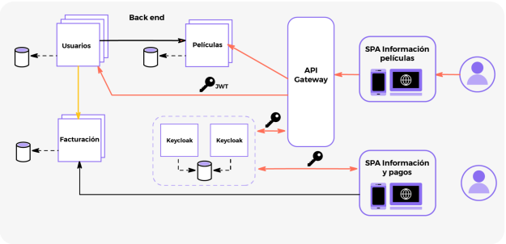

# Seguridad en Microserrvicios

**Alumno:** ***YUNO AL CUARTO***

## Parcial

### Breve descripción del proyecto

Ejecutar el archivo docker-compose.yml con el comando:

    docker-compose up

| Container Name | Image Used                      | Port       | Username | Password |
| -------------- | ------------------------------ | ---------- | -------- | -------- |
| postgres       | postgres:latest                | 5439:5439  | postgres | 1234     |
| mongomoviescontenedor | mongo                   | 27018:27017 | usrmongo | pwdmongo |
| mongobillscontenedor | mongo                   | 27019:27017 | usrmongo | pwdmongo |
| mongousercontenedor  | mongo                   | 27020:27017 | usrmongo | pwdmongo |
| local_keycloak | quay.io/keycloak/keycloak:18.0.2 | 8080:8080  | admin    | admin    |

Loguearse en la consola de administración de Keycloak. Crear el reino ***My-Realm*** importando
las configuraciones con el archivo **My-Realm-realm.json**.

Keycloak se levantará en el puerto 8080:

[http://localhost:8080](http://localhost:8080)

Ingresar al panel de administración con las credenciales establecidas en el archivo docker-compose:

• username: admin
• password: admin

Una vez autenticado, crear un nuevo reino importando el archivo My-Realm-realm.json que se encuentra en la misma carpeta que el archivo “docker-compose”. Seguir estos pasos:

1. Hacer click en "Add realm"
2. Hacer click en "import" e importar el archivo "My-Realm-realm.json"
3. Hacer click en "Create"

En el reino, se crean tres grupos: admin, client y provider. Cada uno de estos tres grupos debe tener un rol (admin, client y provider respectivamente).

Para el correcto funcionamiento, se deberá crear tres usuarios con username y password ya que los usuarios no se guardan en el archivo .json al exportar/importar el reino de Keycloak.

Luego, a cada uno de estos usuarios se les deberá asignar un grupo. El usuario admin se debe asignar al grupo admin, el usuario client se debe asignar al grupo client y el usuario provider se debe asignar al grupo provider.

Una vez creados los usuarios, se puede proceder a levantar los microservicios.

Crear 3 usuarios (admin,client,provider) con los datos que figuran más adelante en este documento. Agregar cada uno a un grupo (admin, client, provider respectivamente).

>ADRIAN, AGREGA LOS SCREENSHOTS QUE TOMASTE AYER PARA QUE EL PROFE NO TENGA EXCUSA!

Levantar los microservicios desde IntelliJ o directamente desde la consola, en el siguiente orden:

1. Eureka-Server

2. Spring-cloud-gateway-keycloak-oauth2 / Api-Gateway 

3. movies-api

4. ms-bills 

5. users-service

> Nota: Los ultimos 3 microservicios de la lista anterior pueden ser levantados en cualquier orden. 

Se crearon tres microservicios y se configuró la seguridad para que estos servicios actúen como servidores de recursos y que todos sus endpoints puedan ser consumidos únicamente por usuarios autenticados. Movies-api y user-service utilizan el cliente de Keycloak microservicios, mientras que ms-bills utiliza al cliente internal, ya que este servicio no será consumido a través del Api Gateway.

Se crea un servicio api-gateway para mapear las urls de los servicios movies-api y users-service. El gateway utiliza el cliente de Keycloak api-gateway. Para consumir los recursos de cualquiera de los dos servicios mapeados, el usuario debe primero autenticarse, de esta forma, por ejemplo, si el usuario no está logueado y quiere acceder al endpoint http://localhost:9090/movies, el gateway lo va a redirigir al login de Keycloak. Unicamente permitirá acceso a los recursos una vez que el usuario haya sido correctamente autenticado (y suponiendo que cumpla con los criterios de autorización para ese endpoint en particular).

A continuación, se presentan 2 tablas con todos los endpoints disponibles en los microservicios users-service y movies-api y sus respectivos permisos.

Microservicio de usuarios (users-service)

| HTTP Method | Endpoint | Rol | Descripción |
|-------------|----------|------|-------------|
| GET         | /users/all | ROLE_admin | Obtiene un listado de todos los usuarios |
| GET         | /users/id/{id} | ROLE_admin | Obtiene un usuario por ID |
| POST        | /users/save | ROLE_admin | Crea o actualiza un usuario |
| GET         | /users/admin | ROLE_admin | Obtiene una lista de todos los usuarios excepto los que tienen ROLE_admin en Keycloak |

> Nota: Todos los endpoints pueden ser accedidos únicamente a traves del Gateway corriendo en el puerto 9090 y requieren un Access Token válido de Keycloak con los roles correspondientes.

Microservicio de peliculas (movies-api)

| HTTP Method | Endpoint                      | Rol                                | Descripción                                                                                                                                                                      |
|-------------|-------------------------------|-------------------------------------|----------------------------------------------------------------------------------------------------------------------------------------------------------------------------------|
| GET         | /movies                             | ROLE_admin, ROLE_client             | Devuelve una lista de todas las peliculas movies.                                                                                                                                                 |
| GET         | /movies/{imdbId}                     | ROLE_admin, ROLE_client             | Devuelve una pelicula por respectivo 'imbdId'                                                                                                                                        |
| POST        | /movies                             | ROLE_admin                          | Crea una nueva pelicula de acuerdo al Body solicitado.                                                                                                                                   |
| PUT         | /movies/{imdbId}                     | ROLE_admin                          | Actualiza una pelicula existente con los detallen provistos.                                                                                                                            |
| DELETE      | /movies/{imdbId}                     | ROLE_admin                          | Elimina una pelicula existente.                                                                                                                                                       |
| POST        | /movies/{imdbId}/comments            | ROLE_admin, ROLE_client             | Añade un comentario a una pelicula específica. El texto del comentario y el nombre del autor (Obtenidos de Principal) son provistos en el Body del request, junto con el imdbId de la pelicula en la URL. |

Al servicio de ms-bills se le configuró  la seguridad para que todos sus endpoints puedan ser consumidos únicamente por usuarios autenticados. Hasta este punto solo usuarios pertenecientes al grupo “provider” podrán dar de alta nuevas facturas.

Se incorpora a este servicio la dependencia de Spring Cloud en pom.xml para utilizar Feign, se configuró Feign con OAuth2, se establece el interceptor de request para inyectar el token de seguridad en todas las llamadas realizadas por Feign y definí la clase OAuthClientCredentialsFeignManager. Luego se creó el endpoint solicitado para que los clientes puedan visualizar todas las facturas asociadas a un usuario de Keycloak y sus datos. Este endpoint únicamente puede ser consumido por usuarios CLIENT. Para crear este endpoint en ms-bills, primero se creó un nuevo endopoint en user-service para buscar a un usuario de Keycloak con sus datos por nombre de usuario. Este endpoint también puede ser consumido únicamente por usuarios CLIENT. Ms-bills se comunica con user-service y consume este endpoint de user-service a través de Feign.
