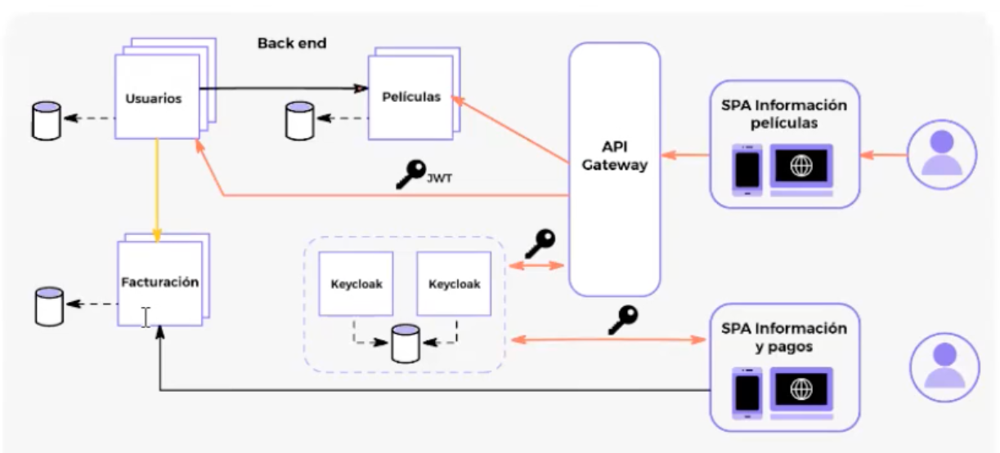

# Seguridad en Microserrvicios

**Alumno:** ***Maria Lucila Arjona Campos***

## Parcial

### Breve descripción del proyecto

Ejecutar el archivo docker-compose.yml con el comando:

    docker-compose up

Loguearse en la consola de administración de Keycloak. Crear el reino ***My-Realm*** importando
las configuraciones con el archivo **My-Realm-realm.json**.

Crear 3 usuarios (useradmin,userclient,userprovider) con los datos que figuran más adelante en este documento. Agregar cada uno a un grupo (admin, client, provider respectivamente).

Levantar los microservicios desde IntelliJ:

Eureka-Server

Api-Gateway

movies-api

users-service

ms-bills

Adjunto la colección de Postman para probar los endpoints. Posee variables de colección muchas de las cuales se setean automáticamente. Para comenzar a trabajar primero hacer request a los endoints 1 y 2 en la subcarpeta autenticación.

Para correr Keycloak, abrir la terminal en la carpeta que posee el archivo “docker-compose.yml”y ejecutar el comando:

    docker-compose up

Keycloak se levantará en el puerto 8082:

[http://localhost:8082](http://localhost:8082)

Ingresar al panel de administración con las credenciales establecidas en el archivo docker-compose:

• username:admin
• password: admin

Una vez autenticado, crear un nuevo reino a partir del archivo DigitalMedia.json que está en lamisma carpeta que el archivo “docker-compose”.

Cada uno de los tres clientes tiene creado un mapper de tipo Group Membership llamado: groups.

En el reino, se crean tres grupos: admin, client y provider. Cada uno de estos tres grupos debe tener un rol (admin, client y provider respectivamente).

Para el correcto funcionamiento, se deberá crear tres usuarios con username, email, first name, last name, password (los usuarios no se guardan en el archivo .json al exportar/importar el reino de Keycloak)

Luego, a cada uno de estos usuarios se les deberá asignar un grupo. El usuario admin se debe asignar al grupo admin, el usuario client se debe asignar al grupo client y el usuario provider se debe asignar al grupo provider.

Una vez creados los usuarios, se puede proceder a levantar los microservicios.
El orden para levantarlos es:
1. eureka-server (Puerto 8761)
2. api-gateway-service (Puerto 8080)
3. movies-api (Puerto 8086), ms-bills (Puerto 8088) y user-service (Puerto8087)- en cualquier orden.

Creé los tres microservicios y les configuré la seguridad para que estos servicios actúen como servidores de recursos y que todos sus endpoints puedan ser consumidos únicamente por usuarios autenticados.

Según lo conversado en clase, Peliculas-Service y Usuarios-Service utilizan el cliente de Keycloak microservicios, mientras que Factuacion-Service utiliza al cliente internal, ya que este servicio no será consumido a través del Api Gateway.

Se crea un servicio api-gateway-service para mapear las urls de los servicios Peliculas-Service y Usuarios-Service. El gateway utiliza el cliente de Keycloak api-gateway. Para consumir los recursos de cualquiera de los dos servicios mapeados, el usuario debe primero autenticarse, de esta forma, por ejemplo, si el usuario no está logueado y quiere acceder al endpoint http://localhost:8080/movies el gateway lo va a redirigir al login de Keycloak. Unicamente permitirá acceso a los recursos una vez que el usuario haya sido correctamente autenticado (y suponiendo que cumpla con los criterios de autorización para ese endpoint en particular). Incluí en la configuración del Gateway el filtro de TokenRelay y un circuit breaker por si los servicios no estuvieran disponibles.

Al microservicio Usuarios-Service le agregué la dependencia necesaria para poder gestionar, mediante servicios REST, los usuarios de Keycloak. El enpoint que obtiene una lista de todos los usuarios no administradores de Keycloak, valida que el usuario este logueado y que sea administrador. El endopoint que crea un nuevo usuario de Keycloak, valida que el usuario este logueado y que sea administrador. Este método no le asigna un password, debe asignarse manualmente desde la consola de administración de Keycloak. El endoint que busca un usuario de Keycloak por su ID, valida que el usuario este logueado y que sea administrador.

Al servicio de Facturación-Service ya le había configurado la seguridad para que todos sus endpoints puedan ser consumidos únicamente por usuarios autenticados. Hasta este punto solo usuarios pertenecientes al grupo “provider” podrán dar de alta nuevas facturas. Además, para poder dar de alta nuevas facturas, el token deberá contener el scope facturacion:gestion.

Se incorpora a este servicio la dependencia de Spring Cloud en pom.xml para utilizar Feign, configuré Feign con OAuth2, se establece el interceptor de request para inyectar el token de seguridad en todas las llamadas realizadas por Feign y definí la clase OAuthClientCredentialsFeignManager. Luego creé el endpoint solicitado para que los clientes puedan visualizar todas las facturas asociadas a un usuario de Keycloak y sus datos. Este endpoint únicamente puede ser consumido por usuarios CLIENT. Para crear este endpoint en ms-bills, primero creé un nuevo endopoint en user-service para buscar a un usuario de Keycloak con sus datos por nombre de usuario. Este endpoint también puede ser consumido únicamente por usuarios CLIENT. bills-service se comunica con user-service y consume este endpoint de user-service a través de Feign.

<!-- 
link de la pagina de emojis ( https://emojipedia.org/apple/ )

[Link descripcion](Link) 

| Tecnología      | Fortaleza |
| --------------- | --------- |
| Front End       | 🔵 🔵 🔵     |
| Back End        | 🔵 ⚪ ⚪     |
| Infraestructura | 🔵 ⚪ ⚪     |
| Testing / QA    | 🔵 🔵 ⚪     |
| Bases de datos  | 🔵 ⚪ ⚪     |

 -->

***

For full documentation visit [mkdocs.org](https://www.mkdocs.org).

## Commands

* `mkdocs new [dir-name]` - Create a new project.
* `mkdocs serve` - Start the live-reloading docs server.
* `mkdocs build` - Build the documentation site.
* `mkdocs -h` - Print help message and exit.

## Project layout

    mkdocs.yml    # The configuration file.
    docs/
        index.md  # The documentation homepage.
        ...       # Other markdown pages, images and other files.
